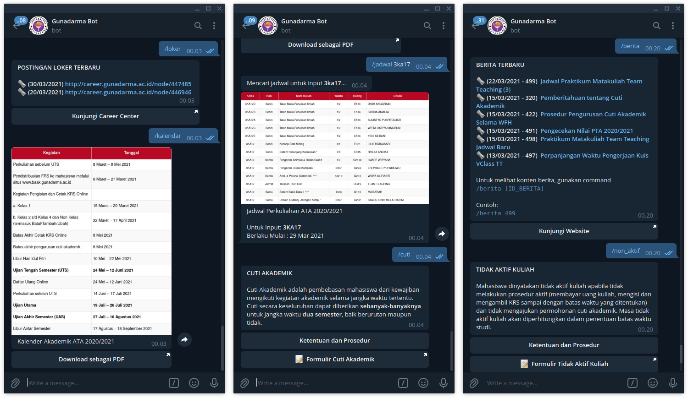

## Gunadarma Telegram Bot

Bot ini merupakan sarana pengaksesan informasi akademik alternatif untuk civitas akademika Universitas Gunadarma.

https://t.me/gunadarma_bot




&nbsp;

## Daftar perintah

Anda dapat berinteraksi dengan Bot ini menggunakan perintah yang tersedia.

| Perintah                     | Deskripsi                                   |
|------------------------------|---------------------------------------------|
| /start                       | Memulai bot                                 |
| /help                        | Menampilkan bantuan                         |
| /berita [ID]                 | Menampilkan berita kampus terbaru           |
| /jadwal \<KELAS_ATAU_DOSEN\> | Mencari jadwal kuliah untuk kelas dan dosen |
| /kalendar                    | Menampilkan kalendar akademik               |
| /jam_kuliah                  | Menampilkan jam kuliah                      |
| /cuti                        | Pengajuan cuti akademik                     |
| /cek_nilai                   | Pengecekan nilai pada DNS                   |
| /non_aktif                   | Pengurusan tidak aktif kuliah               |
| /pindah_kelas                | Permohonan pindah kelas                     |
| /pindah_jurusan              | Permohonan pindah kelas                     |
| /loker                       | Informasi lowongan kerja dari alumni        |

&nbsp;

**Tambahan**:

* Untuk mencari jadwal kuliah, gunakan command

    ```
    /jadwal [KELAS_ATAU_DOSEN]
    ```
    
    Contoh:
    
    ```
    /jadwal 3ka17
    /jadwal tatang ahmad
    ```

* Perintah `/berita` akan menampilkan daftar berita kampus, untuk melihat konten berita, gunakan command:

    ```
    /berita [ID_BERITA]
    ```

    Contoh: 
    ```
    /berita 499
    ```